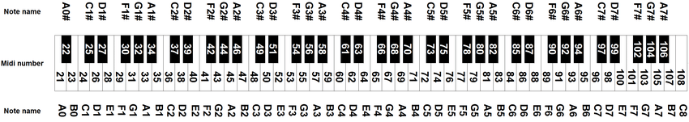
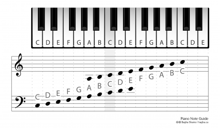

= Busic
:nofooter:
:toc: left

[blockquote, t-h2o]
____
Busic a word to say a "Basic music theory".
____

== Note

[blockquote, wikipedia.com]
____
In music, a note is the representation of a musical sound.
____

What are the difference between 'do' 're' 'mi' and 'C' 'D' 'E'? +
Look this https://en.wikipedia.org/wiki/Musical_note#12-tone_chromatic_scale[table], there are many ways to say the same note.

.wikipedia
* https://en.wikipedia.org/wiki/Musical_note[note]

== Chord

What is a chord ?

[blockquote, wordnik.com]
____
A combination of three or more pitches sounded simultaneously.
____

.wikipedia
* https://en.wikipedia.org/wiki/Chord_(music)[chord]
* https://en.wikipedia.org/wiki/Twelve-bar_blues[Twelve-bar blues]

== Twelve-bar blues

download the pdf link:bar-blues.pdf[PDF page]

image::bar-blues.svg[Static]

== Note MIDI

== Piano

== gamme

check the link:../script/chord.py[source code] to generate this output
----
Major gamme of C -> C  D  E  F  G  A  B
Major gamme of G -> G  A  B  C  D  E  F#
Major gamme of D -> D  E  F# G  A  B  C#
Major gamme of A -> A  B  C# D  E  F# G#
Major gamme of E -> E  F# G# A  B  C# D#
Major gamme of B -> B  C# D# E  F# G# A#
Major gamme of F -> F# G# A# B  C# D# E#

Major gamme of C -> C  D  E  F  G  A  B
Major gamme of F -> F  G  A  Bb C  D  E
Major gamme of B -> Bb C  D  Eb F  G  A
Major gamme of E -> Eb F  G  Ab Bb C  D
Major gamme of A -> Ab Bb C  Db Eb F  G
Major gamme of D -> Db Eb F  Gb Ab Bb C
Major gamme of F -> F  Gb Ab Bb Cb Db Eb
----
